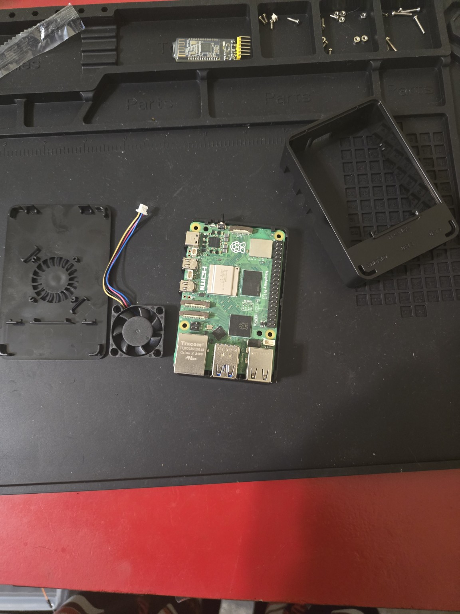
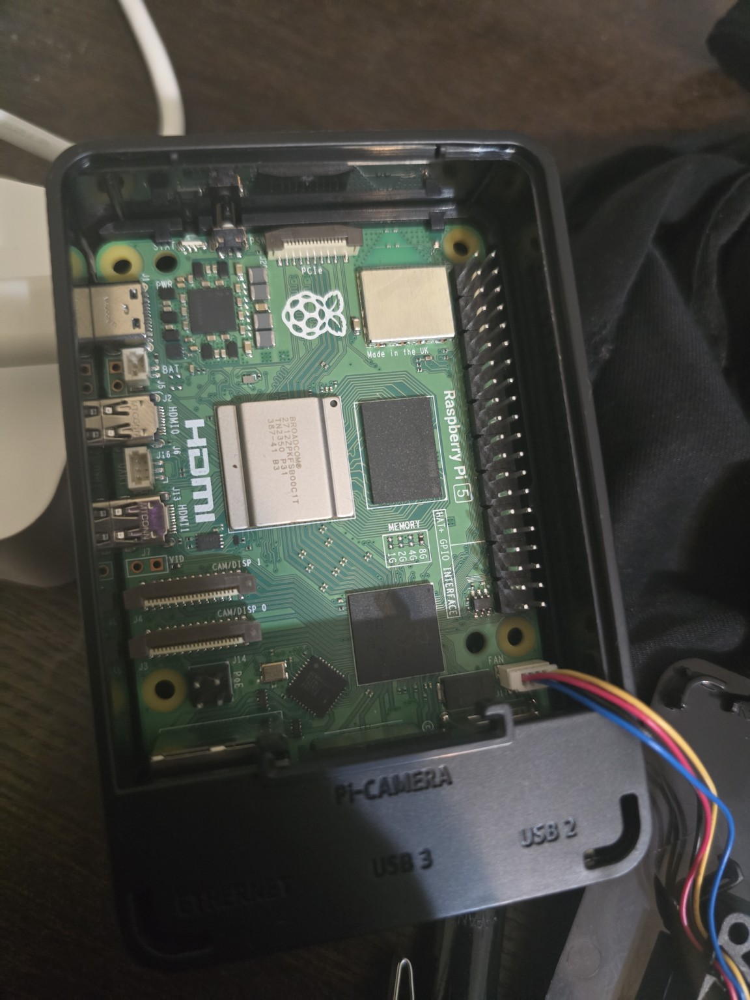
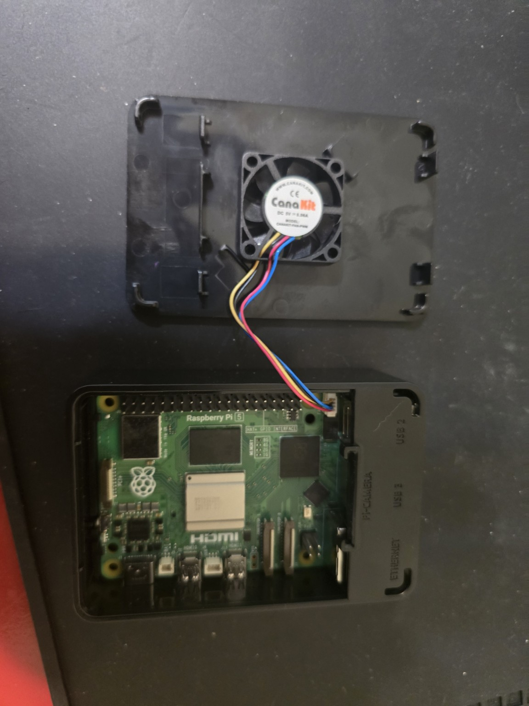
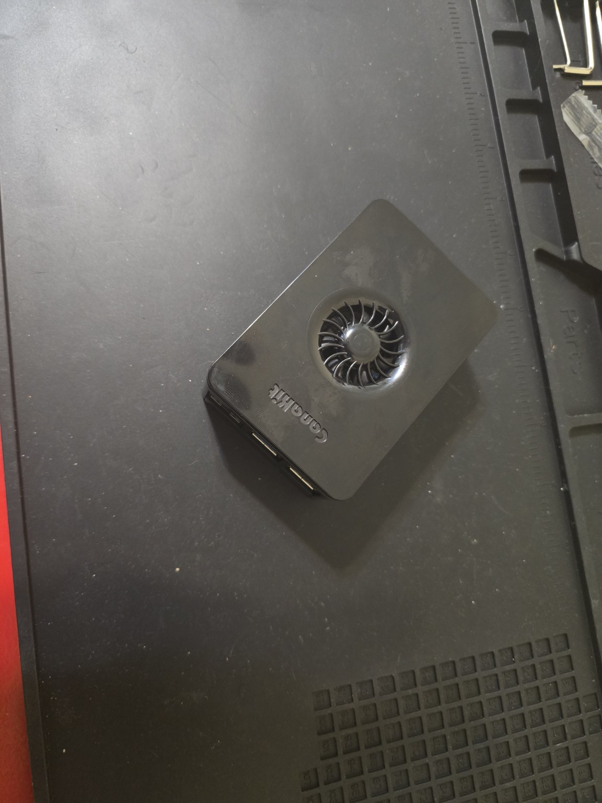

# Raspberry Pi HomeLab Server

## 📌 Project Summary
I built this home lab server to better understand how real systems are deployed, managed, and maintained.  
Using a Raspberry Pi 5, I created a self-hosted environment for cloud services, file storage, and containerized applications.

Throughout the project, I configured the operating system, set up Docker containers, managed network access, and implemented basic security practices. The goal was to create a reliable system that could run continuously while remaining easy to maintain and expand.

## 🎯 Objectives
- Build a personal cloud and services server
- Learn Linux system administration
- Deploy and manage Docker containers
- Configure network access and storage

## ⚙️ Technologies Used
- Raspberry Pi 5 (8GB)
- Linux (Raspberry Pi OS)
- Docker & Docker Compose
- Nextcloud
- Nginx
- SSH
- Networking & firewall configuration

## 🖼️ Hardware Build Log

This section documents the physical teardown and reconstruction of the Raspberry Pi
HomeLab server for inspection, maintainability, and future upgrades.

### Assembly & Teardown

**Initial Assembly**

**Case Opened**

**Cooling Fan Connection**

**Board Exposed**

**Final Assembly**

## 🧠 What I Learned
This project helped me develop practical experience with Linux administration, containerization, and network configuration.  
I also gained confidence troubleshooting hardware and software issues, managing system resources, and documenting system behavior for future upgrades.

## 🚀 Future Improvements
- Add automated backup scripts
- Implement monitoring dashboards
- Expand services and user management

## 🧾 Author
**Brandon Moran**  
Electronics Engineering Technology (EET) | Savannah State University  
Expected Graduation: May 2026
